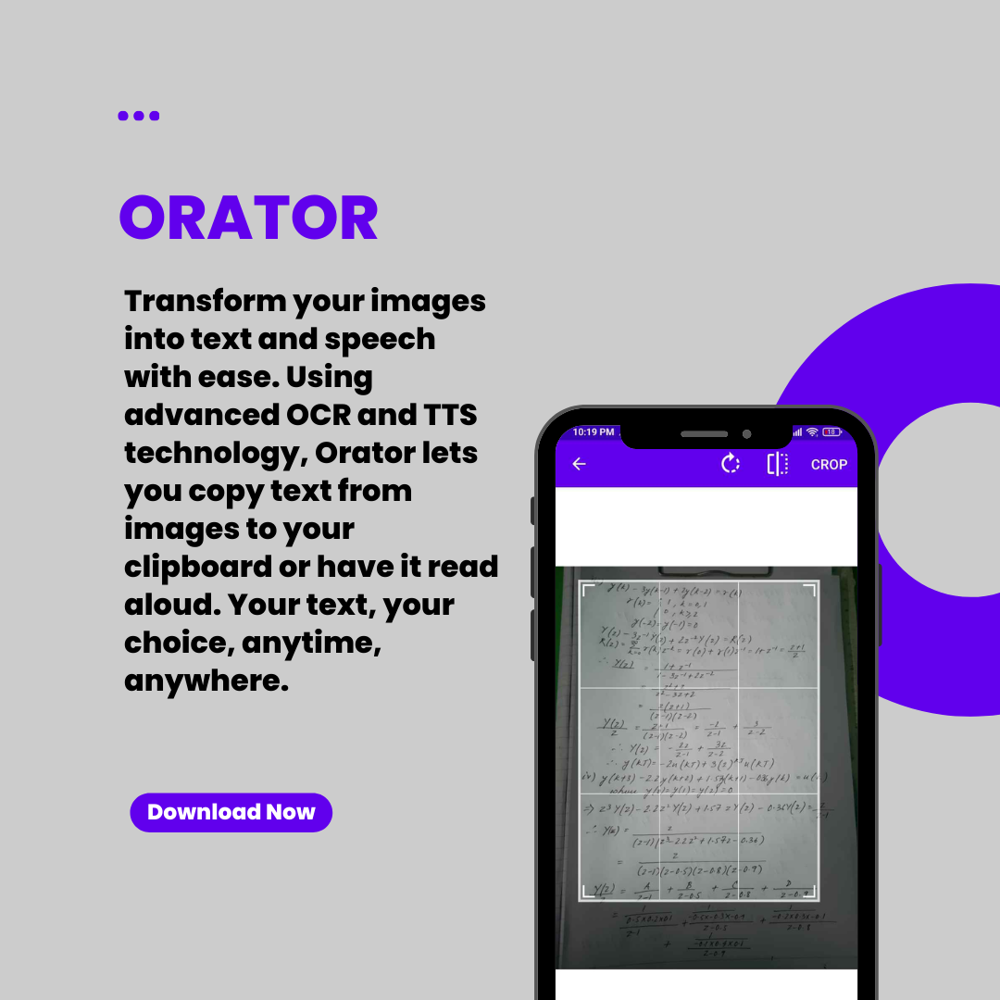

   
      
   
  <h1 align="center">Orator</h1>

## <a name="introduction">🤖 Introduction</a>

Orator is an Android app that converts text in images to text that can be copied to clipboard or converted to speech according to the user's choice. It uses optical character recognition (OCR) technology to recognize text in images, convert it to digital text, and use text-to-speech (TTS) technology to read the text aloud.

## <a name="tech-stack">⚙️ Tech Stack</a>

- Java
- XML
- Android Studio

## <a name="contact">📞 Contact</a>

If you have any queries or feedback, please feel free to reach out to me at my [email](mailto:siktaroy27@gmail.com) or connect with me on [LinkedIn](https://www.linkedin.com/in/sikta-roy-2a0153234/).
